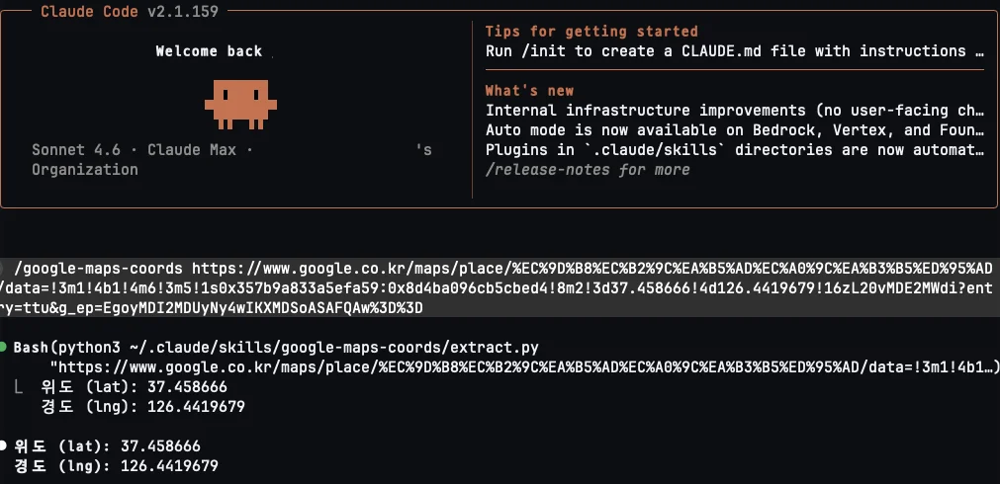
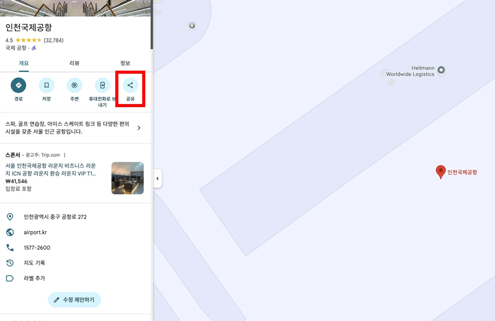
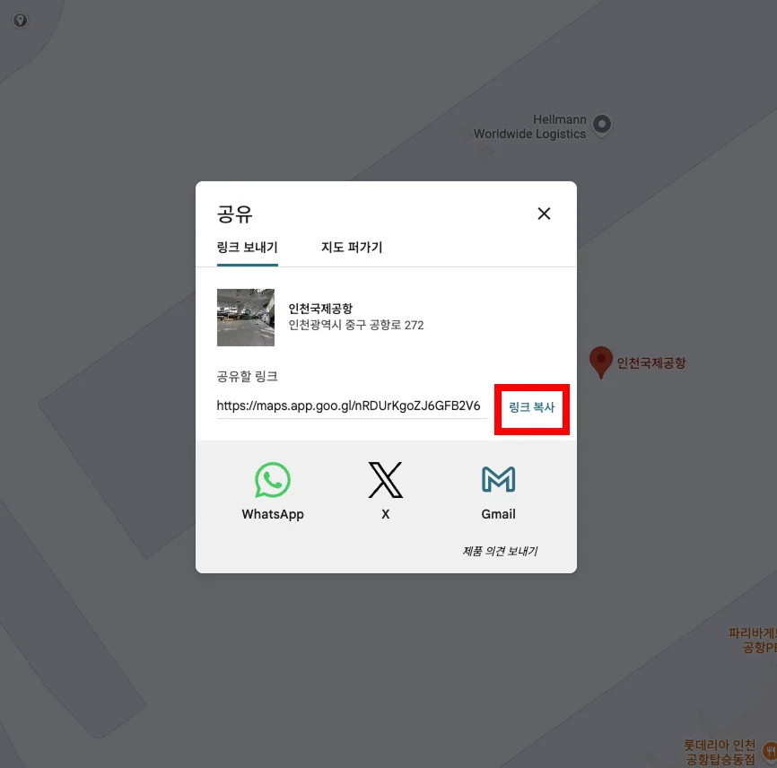
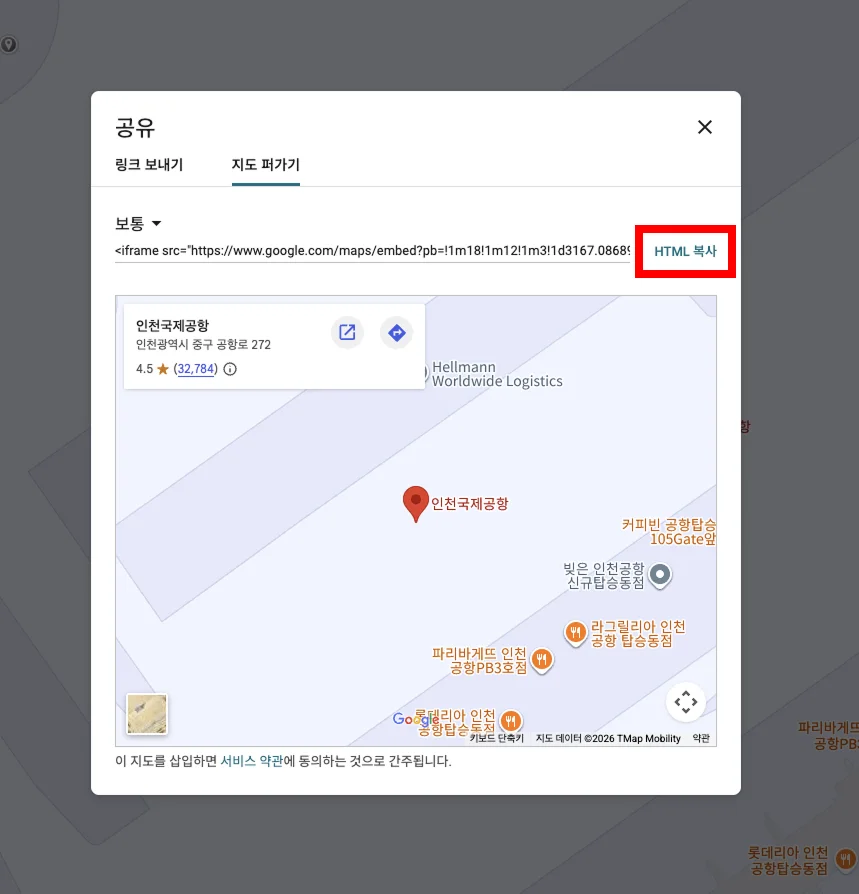
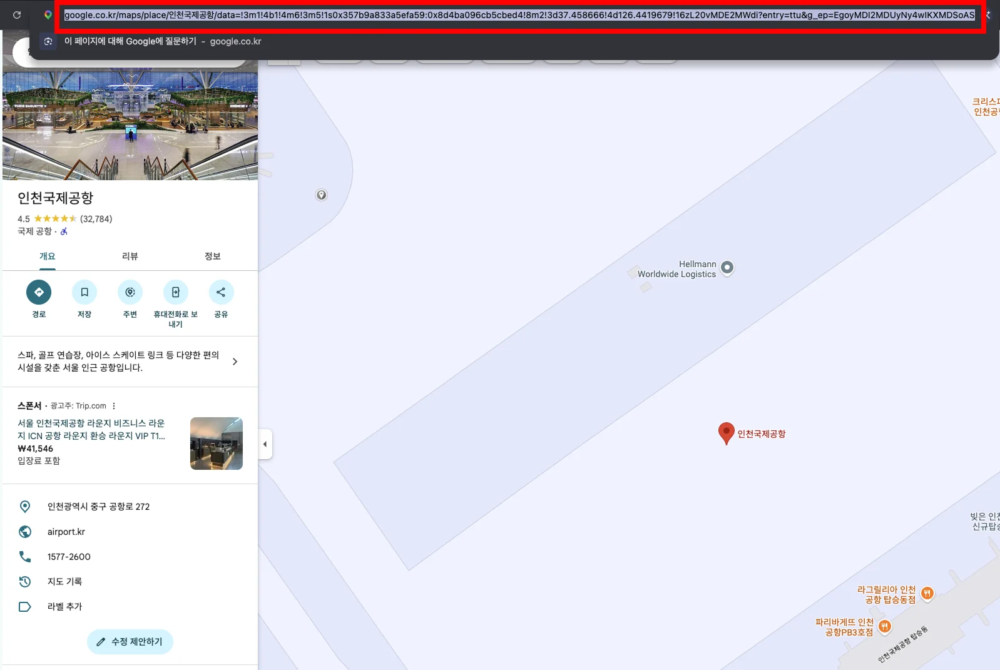

# google-maps-coords

A Claude Code / Codex skill that extracts latitude and longitude from any Google Maps URL.

Supports short URLs, place URLs, search URLs, iframe embeds, and `data=` URLs.



---

## Claude Code

**Install**

```bash
git clone https://github.com/marketadapter/google-maps-coords-skill ~/.claude/skills/google-maps-coords
```

**Use**

```
/google-maps-coords https://maps.app.goo.gl/8RoHXN5UiArPx9xT7
```

---

## Codex

**Install**

```bash
git clone https://github.com/marketadapter/google-maps-coords-skill ~/.agents/skills/google-maps-coords
```

**Use**

```
$google-maps-coords https://maps.app.goo.gl/8RoHXN5UiArPx9xT7
```

---

## Supported URL formats

### Short URL

Click the **Share** button on any place page, then copy the link.





```
https://maps.app.goo.gl/8RoHXN5UiArPx9xT7
```

### iframe embed

Click **Share** → **지도 퍼가기** tab → copy the HTML. Pass only the `src` URL.



```
https://www.google.com/maps/embed?pb=!1m18!1m12!1m3!1d65276.05786105821!2d126.38996362649387!3d37.43737923807508!2m3!1f0!2f0!3f0!3m2!1i1024!2i768!4f13.1!3m3!1m2!1s0x357b9a833a5efa59%3A0x8d4ba096cb5cbed4!2z7J247LKc6rWt7KCc6rO17ZWt!5e0!3m2!1sko!2skr!4v1780363175604!5m2!1sko!2skr
```

### Place URL / data= URL

Copy the URL directly from the browser address bar.



```
https://www.google.com/maps/place/인천국제공항/data=!3m1!4b1!4m6!3m5!1s0x357b9a833a5efa59...!3d37.458666!4d126.4419679
```

### Search URL

```
https://www.google.com/maps?q=37.5665,126.9780
```

---

## Requirements

- Python 3.10+
- `curl` — only needed for short URL resolution. Pre-installed on macOS and Linux. Available on Windows 10+ built-in.

No pip install required.

---

## Standalone CLI

```bash
git clone https://github.com/marketadapter/google-maps-coords-skill
cd google-maps-coords-skill
python3 extract.py "https://maps.app.goo.gl/8RoHXN5UiArPx9xT7"
# 위도 (lat): 37.437379
# 경도 (lng): 126.389964
```
